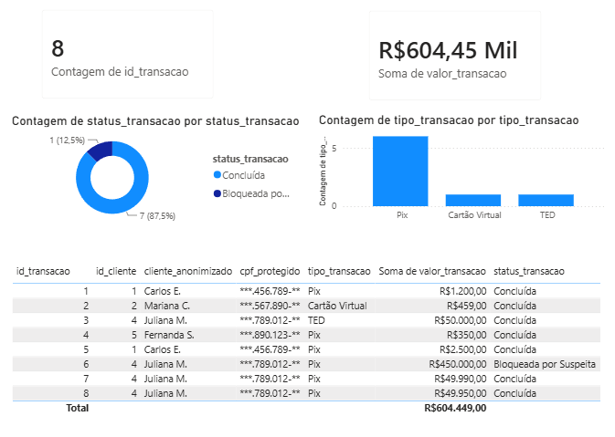
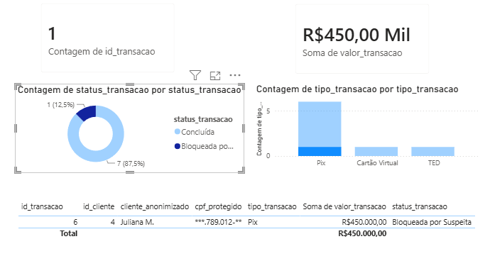
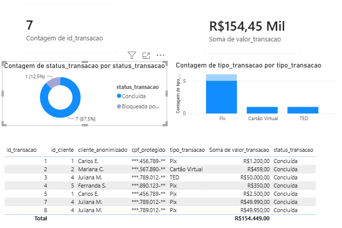
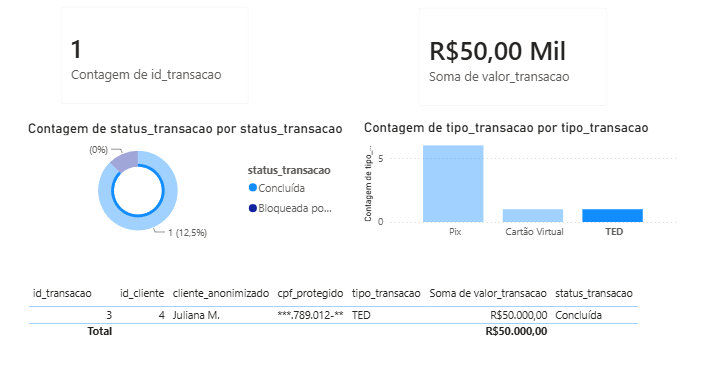

# 🛡️ Lab: Engenharia de Prompts & Analise Forense no SOC Bancário

Este repositório foi desenvolvido como entrega para o **Bootcamp Bradesco e DIO - GenAI, Dados & Cyber**. O projeto une a engenharia de prompts com a simulação de um pipeline de dados ponta a ponta (SQL, Python e Power BI) voltado para Segurança da Cibernética.

> 💡 **Nota de Isenção:** Todo o material, dados de clientes, logs e valores contidos neste laboratório são **estritamente fictícios**. Eles foram gerados e manipulados com o único propósito de aplicar os conhecimentos práticos desenvolvidos durante as aulas e servir como material de apoio didático para quem busca uma base de estudos na área.

---

## 🎯 O Desafio de Prompt (Engenharia de IA)
Em conformidade com as diretrizes da atividade, o objetivo principal foi estruturar um comando mestre (prompt) capaz de orientar uma Inteligência Artificial a atuar como especialista de segurança, analisando cenários sem expor dados sensíveis (LGPD).

*   O arquivo completo com a construção passo a passo e o comando final está disponível em: `DESAFIO_CRIATIVO_PROMPT.md`.

---

## 🛠️ Arquitetura e Processo de Desenvolvimento

O projeto foi lapidado em 3 camadas técnicas complementares, utilizando ferramentas modernas de mercado e conceitos de nuvem:

1. **Modelagem e Infraestrutura de Dados (SQL & Supabase):** 
   * Criação e hospedagem do banco de dados relacional (PostgreSQL) na nuvem utilizando a plataforma **Supabase**.
   * Estruturação de tabelas e inserção de logs de transações financeiras simuladas.
   * Validação e auditoria direta dos dados brutos através do comando:
     ```sql
     SELECT * FROM log_transacoes;
     ```

2. **Pipeline de Engenharia e Execução Moderna (Python - ETL & UV):** 
   * Desenvolvimento de um script focado em extração, limpeza de dados nulos e aplicação de máscaras de privacidade (LGPD).
   * Utilização do gerenciador de pacotes de alta performance **`uv`** para rodar o pipeline de forma isolada, injetando dinamicamente as bibliotecas necessárias para a engenharia de dados através do comando:
     ```bash
     uv run --with pandas --with psycopg2-binary --with sqlalchemy --with python-dotenv 08_etl_python.py
     ```

3. **Dashboard Forense (Power BI):** 
   * Criação de uma central de monitoramento visual (SOC/Threat Hunting) interativa para rastrear volumetria de incidentes, canais visados (como o Pix) e bloqueios preventivos.
---

## 📸 Prova Visual do Painel (SOC)

Aqui está o resultado final da lapidação visual dos dados higienizados:






---

## ⚖️ Direitos Autorais e Licença

Este projeto possui caráter estritamente educativo, de pesquisa e compartilhamento de conhecimento em segurança cibernética.

* **Autor:** Wellington Hikaru Kumagai  
* **Licenciamento de Conteúdo e Pesquisa:** Distribuído sob a Licença **[Creative Commons Atribuição-CompartilhaIgual 4.0 Internacional (CC BY-SA 4.0)](https://creativecommons.org/licenses/by-sa/4.0/deed.pt_BR)**.
* **Licenciamento de Scripts/Código:** Disponibilizado sob a **[Licença MIT](LICENSE)**.

> 📝 **Nota de Permissão:** Você é livre para compartilhar, copiar, distribuir e adaptar este material para fins acadêmicos, corporativos ou profissionais, desde que atribua os créditos ao autor original e distribua suas contribuições sob a mesma licença.

---
